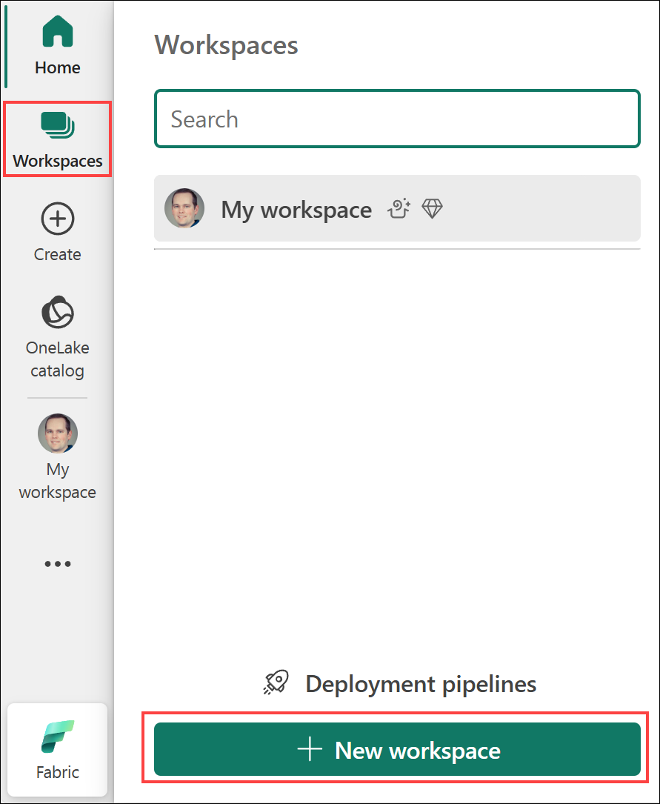
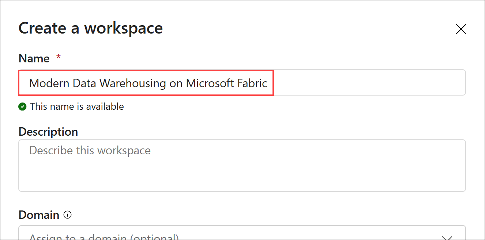
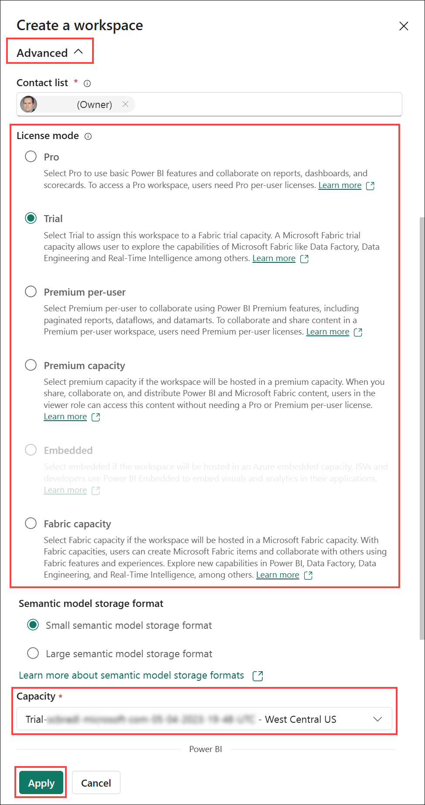
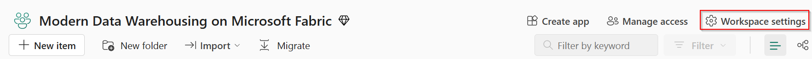
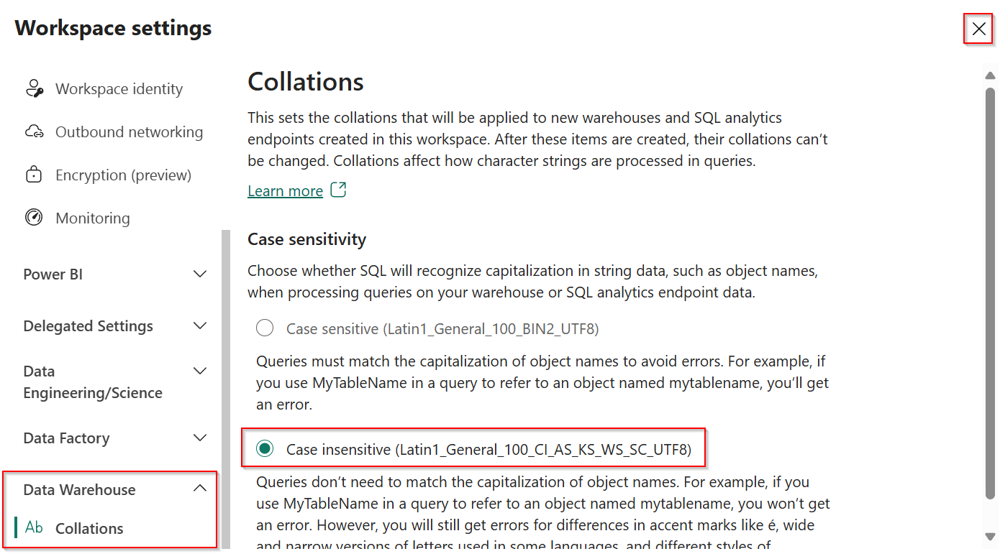
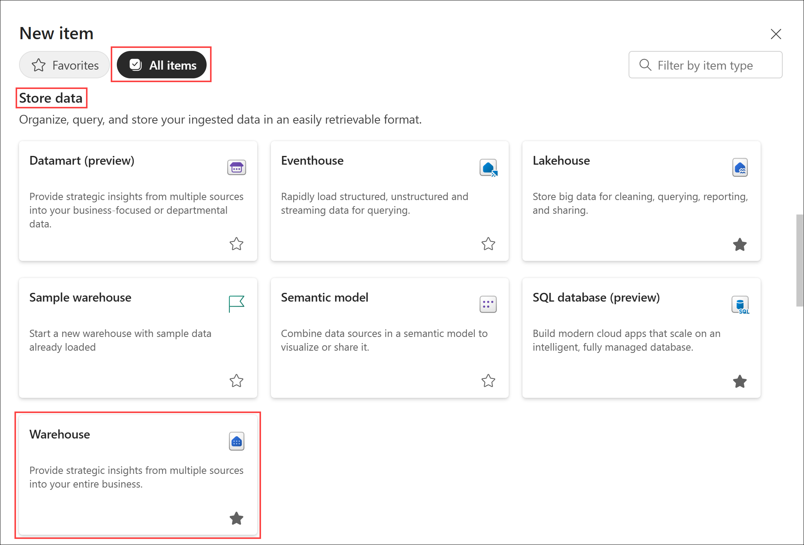
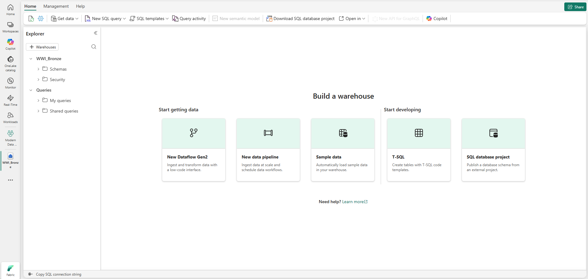
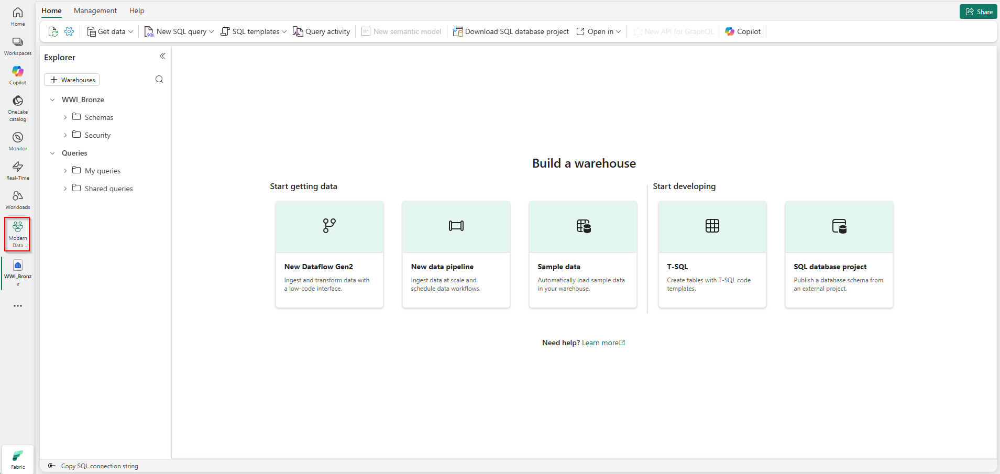
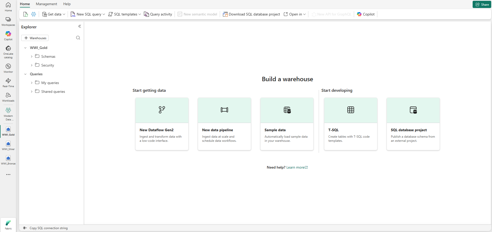

# End-to-End Data Engineering:   Modern Data Warehousing on Microsoft Fabric

## Lab 0 - Lab environment setup

Before you begin:

- Make sure you have read the overview on the [workshop homepage](<../README.md>).

This lab will cover:

- <a href="#0.1">Creating a workspace</a>
- <a href="#0.2">Configuring workspace for case insensitive collation</a>
- <a href="#0.3">Creating a data warehouse for each layer in the medallion architecture</a>

<h3 id="0.1">0.1 - Creating a workspace</h3>

1. Open your web browser and sign in to [Microsoft Fabric](https://fabric.microsoft.com).

1. From the left navigation bar, select **Workspaces** then select **+ New workspace**.

    *Note: The icons on the navigation bar can be pinned and unpinned. Therefore, the icons you see may differ from the screenshot.*

    

1. In the **Create a workspace** pane, in the **Name** box, enter **Modern Data Warehousing on Microsoft Fabric** (add some trailing characters if the name isn't available).

    

1. Expand the **Advanced** section.
    - Change the **License mode** radio button to **Fabric capacity**, **Trial**, or **Premium capacity** based on the type of capacity you have available. *Note: Pro and Premium per user will not work for this workshop as they do not allow Fabric items to be created.*
    - From the **Capacity** dropdown list, select your capacity.
    - Select **Apply** to create and open the new workspace.

    

<h3 id="0.2">0.2 - Configuring workspace for case insensitive collation</h3>

1. With the empty Fabric workspace still open, select **Workspace settings** located in the top right corner.
   
2. Locate **Data Warehouse** settings and expand it. Select **Collations** item and then **Case-insensitive**. Case-insensitive collation is a set of rules for comparing and sorting text that treats uppercase and lowercase letters as equivalent, so "Apple" and "apple" are considered the same. Close the panel by clicking **X**.
   

<h3 id="0.3">0.3 - Creating a data warehouses for each layer in the medallion architecture</h3>

1. With the empty Fabric workspace still open, select **New item** located just below the workspace name.

    

2. From the **All items** view, locate the **Store data** section and select the **Warehouse** tile.

    

3. On the **New warehouse** dialog box, enter the name **WWI_Bronze** and select **Create**. The warehouse will be created and open to the *Build a warehouse* landing page with a set of links to get started quickly. 

   

4. Navigate to the workspace by clicking the workspace icon.
   

5. Repeat steps 1 to 4 to create two more warehouses: **WWI_Silver** and **WWI_Gold**. After you finish, your screen should look like this:
   

## Next steps
In this lab you configured your environment which includes a workspace, a capacity, and a data warehouse for each layer. This is the foundational infrastructure for the remaining labs in this workshop. You are now ready to get started learning how to build a modern data warehouse on Microsoft Fabric!

- Continue to [Lab 1 - Getting started](<01 - Getting started.md>)
- Return to the [workshop homepage](<../README.md>)

## Additional Resources
- [Getting started with Microsoft Fabric](https://www.microsoft.com/en-us/microsoft-fabric/getting-started)
- [Enable Microsoft Fabric for your organization](https://learn.microsoft.com/en-us/fabric/admin/fabric-switch)
- [Fabric region availability](https://learn.microsoft.com/en-us/fabric/admin/region-availability)
- [Microsoft Fabric concepts and licenses](https://learn.microsoft.com/en-us/fabric/enterprise/licenses)
- [Microsoft Fabric trial capacity](https://learn.microsoft.com/en-us/fabric/fundamentals/fabric-trial)
- [Create a Warehouse in Microsoft Fabric](https://learn.microsoft.com/en-us/fabric/data-warehouse/create-warehouse)