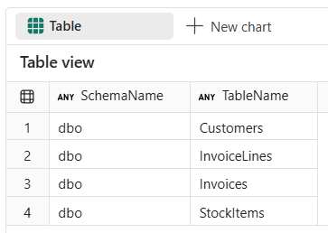
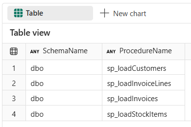
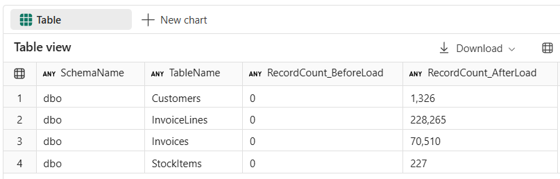

# End-to-End Data Engineering:<br>Modern Data Warehousing on Microsoft Fabric

## Lab 2 - Creating and loading Bronze layer

Before you begin:

- Make sure you have read the overview on the [workshop homepage](<../README.md>).
- If you have not completed [Lab 1 - Getting started](<01 - Getting started.md>), go complete all the steps then return here to continue.

This lab will cover:

- <a href="#2.2">Creating bronze layer tables</a>
- <a href="#2.3">Creating procedures for loading data into bronze layer</a>
- <a href="#2.4">Executing procedures to load the data</a>

<hr>

**Before starting**, make sure that you have BronzeLayer notebook open and connected to WWI_Bronze warehouse. If not, refer to **Lab 1 - Getting started**, locate the **1.3 - T-SQL notebooks** to load and open BronzeLayer notebook, and connect it to WWI_Bronze warehouse.

<h3 id = "2.2">2.2 - Creating bronze layer tables</h3>

Before beginning, open *BronzeLayer* notebook, navigate to **Lab 2 - Creating and loading Bronze layer**, and locate the **2.2 Create bronze layer tables** section.

1. Before creating bronze layer tables, make sure to first drop any tables that may already exist, by running the cell for **Step 2.2.1** in *BronzeLayer* notebook. Upon completion, the cell will have a messages output but no query results.
    - dbo.Customers
    - dbo.StockItems
    - dbo.Invoices
    - dbo.InvoiceLines

    ``` sql
    DROP TABLE IF EXISTS dbo.Customers;
    DROP TABLE IF EXISTS dbo.StockItems;
    DROP TABLE IF EXISTS dbo.Invoices;
    DROP TABLE IF EXISTS dbo.InvoiceLines;
    ```

2. Create the bronze layer tables,by running the cell for **Step 2.2.2** in *BronzeLayer* notebook. Upon completion, the cell will have a messages output but no query results.

    ``` sql
    CREATE TABLE [dbo].[Customers]
    (
        [CustomerID]          [int]           NULL,
        [CustomerName]        [varchar](100)  NULL,
        [ContactPerson]       [varchar](50)   NULL,
        [PhoneNumber]         [varchar](20)   NULL,
        [WebsiteURL]          [varchar](256)  NULL,
        [DeliveryAddressLine] [varchar](60)   NULL,
        [DeliveryPostalCode]  [varchar](10)   NULL,
        [LastEditedWhen]      [datetime2](6)  NULL
    );
    GO
    
    CREATE TABLE [dbo].[InvoiceLines]
    (
        [InvoiceID]      [int]            NULL,
        [InvoiceLineID]  [int]            NULL,
        [StockItemID]    [int]            NULL,
        [Quantity]       [int]            NULL,
        [UnitPrice]      [decimal](18, 2) NULL,
        [TaxRate]        [decimal](18, 3) NULL,
        [TaxAmount]      [decimal](18, 2) NULL,
        [LineProfit]     [decimal](18, 2) NULL,
        [LastEditedWhen] [datetime2](6)   NULL
    );
    GO
    
    CREATE TABLE [dbo].[Invoices]
    (
        [InvoiceID]      [int]          NULL,
        [InvoiceDate]    [datetime2](6) NULL,
        [CustomerID]     [int]          NULL,
        [LastEditedWhen] [datetime2](6) NULL
    );
    GO
    
    CREATE TABLE [dbo].[StockItems]
    (
        [StockItemID]     [int]            NULL,
        [StockItemName]   [varchar](100)   NULL,
        [Brand]           [varchar](50)    NULL,
        [PackageTypeName] [varchar](50)    NULL,
        [TaxRate]         [decimal](18, 3) NULL,
        [UnitPrice]       [decimal](18, 2) NULL,
        [Tags]            [varchar](max)   NULL,
        [LastEditedWhen]  [datetime2](6)   NULL
    );
    GO
    ```

3. Validate that the tables were all created by running the cell for **Step 2.2.3** in *BronzeLayer* notebook and comparing to the output shown below.

    ``` sql
    SELECT
        SCHEMA_NAME(schema_id) AS SchemaName,
        name AS TableName
    FROM sys.tables
    WHERE
        SCHEMA_NAME(schema_id) IN ('dbo')
    ORDER BY
        SchemaName,
        TableName
    ```

    

<h3 id = "2.3">2.3 - Creating stored procedures for loading data into bronze layer</h3>

1. Create procedures, by running the cell for **Step 2.3.1** in *BronzeLayer* notebook. Upon completion, the cell will have a messages output but no query results. Note that you don't need to drop stored procedures first, as you can use CREATE OR ALTER PROCEDURE statement.

    ``` sql
    CREATE OR ALTER PROCEDURE dbo.sp_loadCustomers
    AS
    BEGIN
        TRUNCATE TABLE dbo.Customers;
        COPY INTO dbo.Customers
        FROM 'https://fabricwhtutorialdata.blob.core.windows.net/sampledata/WideWorldImporters/csv/Customers/*.csv'
        WITH (
            FILE_TYPE = 'CSV',
            FIRSTROW = 2
        );
    END
    GO
    
    CREATE OR ALTER PROCEDURE dbo.sp_loadStockItems
    AS
    BEGIN
        TRUNCATE TABLE [dbo].[StockItems];
        COPY INTO dbo.StockItems
        FROM 'https://fabricwhtutorialdata.blob.core.windows.net/sampledata/WideWorldImporters/parquet/StockItems/*.parquet'
        WITH (
            FILE_TYPE = 'PARQUET'
        );
    END
    GO
    
    CREATE OR ALTER PROCEDURE dbo.sp_loadInvoices
    AS
    BEGIN
        TRUNCATE TABLE [dbo].[Invoices];
        INSERT INTO dbo.Invoices
        (
            [InvoiceID],
            [InvoiceDate],
            [CustomerID],
            [LastEditedWhen]
        )
        SELECT
            [InvoiceID],
            [InvoiceDate],
            [CustomerID],
            [LastEditedWhen]
        FROM OPENROWSET(BULK 'https://fabricwhtutorialdata.blob.core.windows.net/sampledata/WideWorldImporters/parquet/Invoices/*.parquet');
    END
    GO
    
    CREATE OR ALTER PROCEDURE dbo.sp_loadInvoiceLines
    AS
    BEGIN
        TRUNCATE TABLE [dbo].[InvoiceLines];
        COPY INTO dbo.InvoiceLines
        FROM 'https://fabricwhtutorialdata.blob.core.windows.net/sampledata/WideWorldImporters/parquet/InvoiceLines/*.parquet'
        WITH (
            FILE_TYPE = 'PARQUET'
        );
    END
    GO
    ```

2. Validate that the tables were all created by running the cell for **Step 2.3.2** in *BronzeLayer* notebook and comparing to the output shown below.

    ``` sql
    SELECT
        SCHEMA_NAME(p.schema_id) AS SchemaName,
        p.name AS ProcedureName
    FROM
        sys.procedures AS p
    WHERE
        SCHEMA_NAME(p.schema_id) = 'dbo'
    ORDER BY
        SchemaName, ProcedureName
    ```

    

<h3 id = "2.4">Executing procedures to load the data</h3>

1. Execute all procedures for loading data into bronze layer.

    ``` sql
    DECLARE @CountBeforeLoadCustomers  BIGINT = (SELECT COUNT_BIG(*) FROM dbo.Customers)
    DECLARE @CountBeforeLoadStockItems     BIGINT = (SELECT COUNT_BIG(*) FROM dbo.StockItems)
    DECLARE @CountBeforeLoadInvoices BIGINT = (SELECT COUNT_BIG(*) FROM dbo.Invoices)
    DECLARE @CountBeforeLoadInvoiceLines     BIGINT = (SELECT COUNT_BIG(*) FROM dbo.InvoiceLines)
       
    EXEC dbo.sp_loadCustomers;
    EXEC dbo.sp_loadStockItems;
    EXEC dbo.sp_loadInvoices;
    EXEC dbo.sp_loadInvoiceLines;
    
    SELECT 'dbo'   AS SchemaName, 'Customers'       AS TableName, FORMAT(@CountBeforeLoadCustomers,     'N0') AS RecordCount_BeforeLoad, FORMAT(COUNT_BIG(*), 'N0') AS RecordCount_AfterLoad FROM dbo.Customers        UNION ALL
    SELECT 'dbo'   AS SchemaName, 'StockItems'    AS TableName, FORMAT(@CountBeforeLoadStockItems,  'N0') AS RecordCount_BeforeLoad, FORMAT(COUNT_BIG(*), 'N0') AS RecordCount_AfterLoad FROM dbo.StockItems     UNION ALL
    SELECT 'dbo'   AS SchemaName, 'Invoices'   AS TableName, FORMAT(@CountBeforeLoadInvoices, 'N0') AS RecordCount_BeforeLoad, FORMAT(COUNT_BIG(*), 'N0') AS RecordCount_AfterLoad FROM dbo.Invoices    UNION ALL
    SELECT 'dbo'   AS SchemaName, 'InvoiceLines'       AS TableName, FORMAT(@CountBeforeLoadInvoiceLines,     'N0') AS RecordCount_BeforeLoad, FORMAT(COUNT_BIG(*), 'N0') AS RecordCount_AfterLoad FROM dbo.InvoiceLines
    ORDER BY
        SchemaName,
        TableName
    ```

2. Compare the output with the screenshot below. If it matches, load was successful.



## Next steps
In this lab you created bronze layer tables to hold all the raw data before it is transformed into the silver layer. You also created all the procedures needed to load the data from the storage to the bronze layer.

- Continue to [Lab 3 - Creating and loading Silver layer](<03 - Creating and loading Silver layer.md>)
- Return to the [workshop homepage](<../README.md>)

## Additional Resources
- [Tables in data warehousing in Microsoft Fabric](https://learn.microsoft.com/en-us/fabric/data-warehouse/tables)
- [Data types in Microsoft Fabric](https://learn.microsoft.com/en-us/fabric/data-warehouse/data-types)
- [Ingesting data into Microsoft Fabric Warehouse](https://learn.microsoft.com/en-us/fabric/data-warehouse/ingest-data)
- [Ingest data into your Warehouse using the COPY statement](https://learn.microsoft.com/en-us/fabric/data-warehouse/ingest-data-copy)
- [Ingest data via T-SQL](https://learn.microsoft.com/en-us/fabric/data-warehouse/ingest-data-tsql)
- [Browse file content using OPENROWSET function](https://learn.microsoft.com/en-us/fabric/data-warehouse/browse-file-content-with-openrowset)
