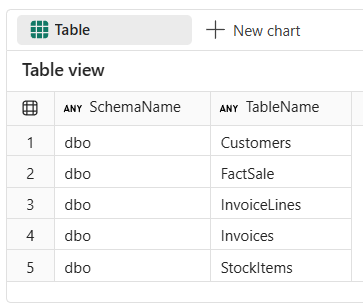
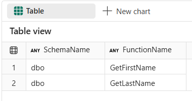
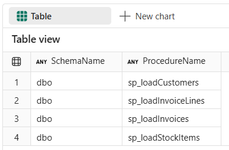
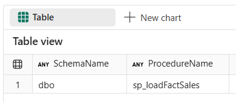
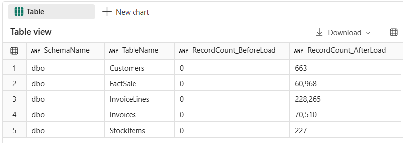

# End-to-End Data Engineering:<br>Modern Data Warehousing on Microsoft Fabric

## Lab 3 - Creating and loading Silver layer

Before you begin:

- Make sure you have read the overview on the [workshop homepage](<../README.md>).
- If you have not completed [Lab 2 - Creating and loading Bronze layer](<02 - Creating and loading Bronze layer.md>), go complete all the steps then return here to continue.

This lab will cover:

- <a href="#3.1">Creating silver layer tables</a>
- <a href="#3.2">Creating procedures for loading dim data into silver layer</a>
- <a href="#3.3">Creating procedures for loading fact data into silver layer</a>
- <a href="#3.4">Executing procedures to load the data</a>

<hr>

**Before starting**, make sure that you have SilverLayer notebook open and connected to WWI_Silver warehouse. If not, refer to **Lab 1 - Getting started**, locate the **1.3 - T-SQL notebooks** to load and open SilverLayer notebook, and connect it to WWI_Silver warehouse.

<h3 id = "3.1">3.1 - Creating silver layer tables</h3>

Before beginning, open *SilverLayer* notebook, navigate to **Lab 3 - Creating and loading Silver layer**, and locate the **3.1 Create silver layer tables** section.

1. Before creating silver layer tables, make sure to first drop any tables that may already exist, by running the cell for **Step 3.1.1** in *SilverLayer* notebook. Upon completion, the cell will have a messages output but no query results.
    - dbo.Customers
    - dbo.StockItems
    - dbo.Invoices
    - dbo.InvoiceLines
    - dbo.FactSale

    ``` sql
    DROP TABLE IF EXISTS dbo.Customers;
    DROP TABLE IF EXISTS dbo.StockItems;
    DROP TABLE IF EXISTS dbo.Invoices;
    DROP TABLE IF EXISTS dbo.InvoiceLines;
    DROP TABLE IF EXISTS dbo.FactSale;
    ```

2. Create the silver layer tables,by running the cell for **Step 3.1.2** in *SilverLayer* notebook. Upon completion, the cell will have a messages output but no query results.

    ``` sql
    CREATE TABLE [dbo].[Customers]
    (
        [CustomerID]          [int]           NULL,
        [CustomerName]        [varchar](100)  NULL,
        -- [ContactPerson]       [varchar](50)   NULL,
        [ContactFirstName]    [varchar](50)   NULL,
        [ContactLastName]     [varchar](50)   NULL,
        [PhoneNumber]         [varchar](20)   NULL,
        [WebsiteURL]          [varchar](256)  NULL,
        [DeliveryAddressLine] [varchar](60)   NULL,
        [DeliveryPostalCode]  [varchar](10)   NULL,
        [LastEditedWhen]      [datetime2](6)  NULL
    );
    GO
    
    CREATE TABLE [dbo].[InvoiceLines]
    (
        [InvoiceID]      [int]            NULL,
        [InvoiceLineID]  [int]            NULL,
        [StockItemID]    [int]            NULL,
        [Quantity]       [int]            NULL,
        [UnitPrice]      [decimal](18, 2) NULL,
        [TaxRate]        [decimal](18, 3) NULL,
        [TaxAmount]      [decimal](18, 2) NULL,
        [LineProfit]     [decimal](18, 2) NULL,
        [LastEditedWhen] [datetime2](6)   NULL
    );
    GO
    
    CREATE TABLE [dbo].[Invoices]
    (
        [InvoiceID]      [int]          NULL,
        [InvoiceDate]    [datetime2](6) NULL,
        [CustomerID]     [int]          NULL,
        [LastEditedWhen] [datetime2](6) NULL
    );
    GO
    
    CREATE TABLE [dbo].[StockItems]
    (
        [StockItemID]     [int]            NULL,
        [StockItemName]   [varchar](100)   NULL,
        [Brand]           [varchar](50)    NULL,
        [PackageTypeName] [varchar](50)    NULL,
        [TaxRate]         [decimal](18, 3) NULL,
        [UnitPrice]       [decimal](18, 2) NULL,
        [Tags]            [varchar](max)   NULL,
        [LastEditedWhen]  [datetime2](6)   NULL
    );
    GO
    
    CREATE TABLE [dbo].[FactSale]
    (
        [InvoiceDate]    [datetime2](6)   NULL,
        [InvoiceID]      [int]            NULL,
        [Quantity]       [int]            NULL,
        [UnitPrice]      [decimal](18, 2) NULL,
        [TaxRate]        [decimal](18, 3) NULL,
        [TaxAmount]      [decimal](18, 2) NULL,
        [LineProfit]     [decimal](18, 2) NULL,
        [CustomerID]     [int]            NULL,
        [StockItemID]    [int]            NULL
    );
    GO
    ```

3. Validate that the tables were all created by running the cell for **Step 3.1.3** in *SilverLayer* notebook and comparing to the output shown below.

    ``` sql
    SELECT
        SCHEMA_NAME(schema_id) AS SchemaName,
        name AS TableName
    FROM sys.tables
    WHERE
        SCHEMA_NAME(schema_id) IN ('dbo')
    ORDER BY
        SchemaName,
        TableName
    ```

    

<h3 id = "3.2">3.2 - Creating stored procedures for loading dim data into silver layer</h3>

1. You will use user defined functions to encapsulate business logic of extracting first and last name from column values containing full names. Create functions by running the cell for **Step 3.2.1** in *SilverLayer* notebook. Upon completion, the cell will have a messages output but no query results.

    ``` sql
    CREATE OR ALTER FUNCTION dbo.GetFirstName (@FullName VARCHAR(100))
    RETURNS VARCHAR(50)
    AS
    BEGIN
        RETURN SUBSTRING(@FullName, 1, CHARINDEX(' ', @FullName) - 1)
    END
    GO
    
    CREATE OR ALTER FUNCTION dbo.GetLastName (@FullName VARCHAR(100))
    RETURNS VARCHAR(100)
    AS
    BEGIN
        RETURN SUBSTRING(@FullName, CHARINDEX(' ', @FullName) + 1, LEN(@FullName))
    END
    GO
    ```

2. Validate that functions were all created by running the cell for **Step 3.2.2** in *SilverLayer* notebook and comparing to the output shown below.

    ``` sql
    SELECT
        SCHEMA_NAME(obj.schema_id) AS SchemaName,
        obj.name AS FunctionName
    FROM sys.objects obj
    WHERE obj.type = 'FN' AND SCHEMA_NAME(schema_id) = 'dbo'
    ORDER BY
        SCHEMA_NAME(schema_id),
        obj.name
    ```

    

3. Create procedures for loading dim data from bronze to silver layer, by running the cell for **Step 3.2.3** in *SilverLayer* notebook. Upon completion, the cell will have a messages output but no query results. Note that you don't need to drop stored procedures first, as you can use CREATE OR ALTER PROCEDURE statement.

    ``` sql
    CREATE OR ALTER PROCEDURE dbo.sp_loadCustomers
    AS
    BEGIN
        TRUNCATE TABLE [dbo].[Customers];
        INSERT INTO dbo.Customers
        SELECT DISTINCT
            CustomerID,
            CustomerName=LTRIM(RTRIM(CustomerName)),
            ContactFirstName=dbo.GetFirstName(ContactPerson), -- SUBSTRING(ContactPerson, 1, CHARINDEX(' ', ContactPerson) - 1),
            ContactLastName=dbo.GetLastName(ContactPerson), --SUBSTRING(ContactPerson, CHARINDEX(' ', ContactPerson) + 1, LEN(ContactPerson)),    
            PhoneNumber,
            WebsiteURL,
            DeliveryAddressLine,
            DeliveryPostalCode,
            LastEditedWhen
        FROM WWI_Bronze.dbo.Customers;
    END
    GO
    
    CREATE OR ALTER PROCEDURE dbo.sp_loadInvoices
    AS
    BEGIN
        TRUNCATE TABLE [dbo].[Invoices];
        INSERT INTO dbo.Invoices
        SELECT
            [InvoiceID],
            [InvoiceDate],
            [CustomerID],
            [LastEditedWhen]
        FROM WWI_Bronze.dbo.Invoices;
    END
    GO
    
    CREATE OR ALTER PROCEDURE dbo.sp_loadInvoiceLines
    AS
    BEGIN
        TRUNCATE TABLE [dbo].[InvoiceLines];
        INSERT INTO dbo.InvoiceLines
        SELECT
            [InvoiceID],
            [InvoiceLineID],
            [StockItemID],
            [Quantity],
            [UnitPrice],
            ISNULL(TaxRate,0.0) AS [TaxRate],
            ISNULL(TaxAmount,0.0) AS [TaxAmount],
            [LineProfit],
            [LastEditedWhen]
        FROM WWI_Bronze.dbo.InvoiceLines
        WHERE ISNULL(Quantity,0.0) > 0 AND ISNULL(UnitPrice,0.0) > 0 AND ISNULL(TaxRate,0.0) >= 0 AND ISNULL(TaxAmount,0.0) >= 0;
    END
    GO
    
    CREATE OR ALTER PROCEDURE dbo.sp_loadStockItems
    AS
    BEGIN
        TRUNCATE TABLE [dbo].[StockItems];
        INSERT INTO dbo.StockItems
        SELECT
            [StockItemID],
            [StockItemName],
            ISNULL(LTRIM(RTRIM([Brand])), null),
            ISNULL(LTRIM(RTRIM([PackageTypeName])), null),
            [TaxRate],
            [UnitPrice],
            [Tags],
            [LastEditedWhen]
        FROM WWI_Bronze.dbo.StockItems;
    END
    GO
    ```

4. Validate that the procedures were all created by running the cell for **Step 3.2.4** in *SilverLayer* notebook and comparing to the output shown below.

    ``` sql
    SELECT
        SCHEMA_NAME(p.schema_id) AS SchemaName,
        p.name AS ProcedureName
    FROM
        sys.procedures AS p
    WHERE
        SCHEMA_NAME(p.schema_id) = 'dbo'
    ORDER BY
        SchemaName, ProcedureName
    ```

    

<h3 id = "3.3">3.3 - Creating procedures for loading fact data into silver layer</h3>

3. Create procedure for loading fact data from bronze to silver layer, by running the cell for **Step 3.3.1** in *SilverLayer* notebook. Upon completion, the cell will have a messages output but no query results. Note that you don't need to drop stored procedures first, as you can use CREATE OR ALTER PROCEDURE statement. Note that this procedure is built to load specific year based on argument so we can later simulate incremental load. If no argument is specified, all data will be loaded.

    ``` sql
    CREATE OR ALTER PROCEDURE dbo.sp_loadFactSales(@InvoiceYear INT = NULL)
    AS
    BEGIN
        IF @InvoiceYear IS NOT NULL
        BEGIN
            DELETE dbo.FactSale WHERE YEAR(InvoiceDate) = @InvoiceYear
        END
        ELSE
        BEGIN
            TRUNCATE TABLE dbo.FactSale
        END
    
        INSERT INTO dbo.FactSale
        SELECT
            i.InvoiceDate,
            i.InvoiceID,
            il.Quantity,
            il.UnitPrice,
            il.TaxRate,
            il.TaxAmount,
            il.LineProfit,
            i.CustomerID,
            il.StockItemID
        FROM dbo.Invoices AS i
        INNER JOIN dbo.InvoiceLines AS il
            ON i.InvoiceID = il.InvoiceID
        INNER JOIN dbo.StockItems AS si
            ON il.StockItemID = si.StockItemID
        INNER JOIN dbo.Customers AS c
            ON i.CustomerID = c.CustomerID
        WHERE YEAR(i.InvoiceDate) = ISNULL(@InvoiceYear, YEAR(i.InvoiceDate));
    END
    GO
    ```

4. Validate that the procedure was created by running the cell for **Step 3.3.2** in *SilverLayer* notebook and comparing to the output shown below.

    ``` sql
    SELECT
        SCHEMA_NAME(p.schema_id) AS SchemaName,
        p.name AS ProcedureName
    FROM
        sys.procedures AS p
    WHERE
        SCHEMA_NAME(p.schema_id) = 'dbo' AND p.name = 'sp_loadFactSales'
    ORDER BY
        SchemaName, ProcedureName
    ```

    

<h3 id = "3.4">3.4 - Executing procedures to load the data</h3>

1. Execute all procedures for loading data into silver layer. Note that at this stage of lab we are loading only year 2013. to fact table.

    ``` sql
    DECLARE @CountBeforeLoadCustomers  BIGINT = (SELECT COUNT_BIG(*) FROM dbo.Customers)
    DECLARE @CountBeforeLoadStockItems     BIGINT = (SELECT COUNT_BIG(*) FROM dbo.StockItems)
    DECLARE @CountBeforeLoadInvoices BIGINT = (SELECT COUNT_BIG(*) FROM dbo.Invoices)
    DECLARE @CountBeforeLoadInvoiceLines     BIGINT = (SELECT COUNT_BIG(*) FROM dbo.InvoiceLines)
    DECLARE @CountBeforeLoadFactSale     BIGINT = (SELECT COUNT_BIG(*) FROM dbo.FactSale)
    
    EXEC dbo.sp_loadCustomers;
    EXEC dbo.sp_loadStockItems;
    EXEC dbo.sp_loadInvoices;
    EXEC dbo.sp_loadInvoiceLines;
    EXEC dbo.sp_loadFactSales @InvoiceYear = 2013
    
    SELECT 'dbo'   AS SchemaName, 'Customers'       AS TableName, FORMAT(@CountBeforeLoadCustomers,     'N0') AS RecordCount_BeforeLoad, FORMAT(COUNT_BIG(*), 'N0') AS RecordCount_AfterLoad FROM dbo.Customers        UNION ALL
    SELECT 'dbo'   AS SchemaName, 'StockItems'    AS TableName, FORMAT(@CountBeforeLoadStockItems,  'N0') AS RecordCount_BeforeLoad, FORMAT(COUNT_BIG(*), 'N0') AS RecordCount_AfterLoad FROM dbo.StockItems     UNION ALL
    SELECT 'dbo'   AS SchemaName, 'Invoices'   AS TableName, FORMAT(@CountBeforeLoadInvoices, 'N0') AS RecordCount_BeforeLoad, FORMAT(COUNT_BIG(*), 'N0') AS RecordCount_AfterLoad FROM dbo.Invoices    UNION ALL
    SELECT 'dbo'   AS SchemaName, 'InvoiceLines'       AS TableName, FORMAT(@CountBeforeLoadInvoiceLines,     'N0') AS RecordCount_BeforeLoad, FORMAT(COUNT_BIG(*), 'N0') AS RecordCount_AfterLoad FROM dbo.InvoiceLines    UNION ALL
    SELECT 'dbo'   AS SchemaName, 'FactSale'       AS TableName, FORMAT(@CountBeforeLoadFactSale,     'N0') AS RecordCount_BeforeLoad, FORMAT(COUNT_BIG(*), 'N0') AS RecordCount_AfterLoad FROM dbo.FactSale
    ORDER BY
        SchemaName,
        TableName
    ```

2. Compare the output with the screenshot below. If it matches, load was successful.



## Next steps
In this lab you created silver layer tables to hold all the raw data before it is transformed into the gold layer. You also created all the procedures needed to load the data from the bronze to the silver layer.

- Continue to [Lab 4 - Creating and loading Gold layer](<04 - Creating and loading Gold layer.md>)
- Return to the [workshop homepage](<../README.md>)

## Additional Resources
- [Ingest data via T-SQL](https://learn.microsoft.com/en-us/fabric/data-warehouse/ingest-data-tsql)
- [Primary keys, foreign keys, and unique keys in Warehouse in Microsoft Fabric](https://learn.microsoft.com/en-us/fabric/data-warehouse/table-constraints)
- [Transactions in Warehouse tables in Microsoft Fabric](https://learn.microsoft.com/en-us/fabric/data-warehouse/transactions)
- [Dimensional modeling in Microsoft Fabric Warehouse: Dimension tables](https://learn.microsoft.com/en-us/fabric/data-warehouse/dimensional-modeling-dimension-tables)
- [Dimensional modeling in Microsoft Fabric Warehouse: Fact tables](https://learn.microsoft.com/en-us/fabric/data-warehouse/dimensional-modeling-fact-tables)

