# End-to-End Data Engineering:<br>Modern Data Warehousing on Microsoft Fabric

## Lab 5 - Orchestrating warehouse operations

Before you begin:

- Make sure you have read the overview on the [workshop homepage](<../README.md>).
- If you have not completed [Lab 4 - Creating and loading Gold layer](<04 - Creating and loading Gold layer.md>), go complete all the steps then return here to continue.

This lab will cover:

- <a href="#5.1">Building an orchestration pipeline</a>
- <a href="#5.2">Running the pipeline</a>
- <a href="#5.3">Validating dimensional model load</a>
- <a href="#5.4">Scheduling the pipeline</a>

<hr>

<h3 id = "5.1">5.1 - Building an orchestration pipeline</h3>

1. Return to the *Modern Data Warehousing on Microsoft Fabric* workspace created in *Lab 0 - Lab environment setup* by selecting the **workspace icon** from the left navigation bar. 

    *Note: The icons on the navigation bar can be pinned and unpinned. Therefore, the icons you see may differ from the screenshot.*

    

2. Select **New item** located just below the workspace name.

    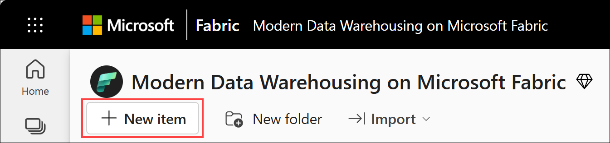

3. From the **All items** view, locate the **Get data** section, or type "*data pipeline*" in the filter on the right hand side, and select the **Data pipeline** tile.

    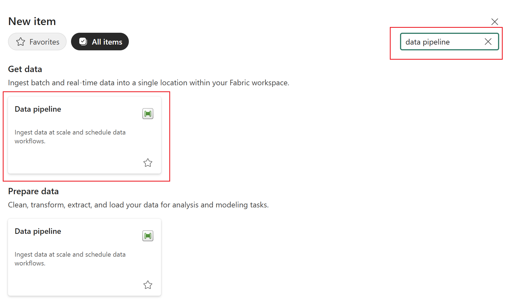

4. On the **New pipeline** dialog box, enter the name **Load Medallion** and select **Create**. The pipeline will be created and open to a blank canvas with a set of links to get started quickly. 

    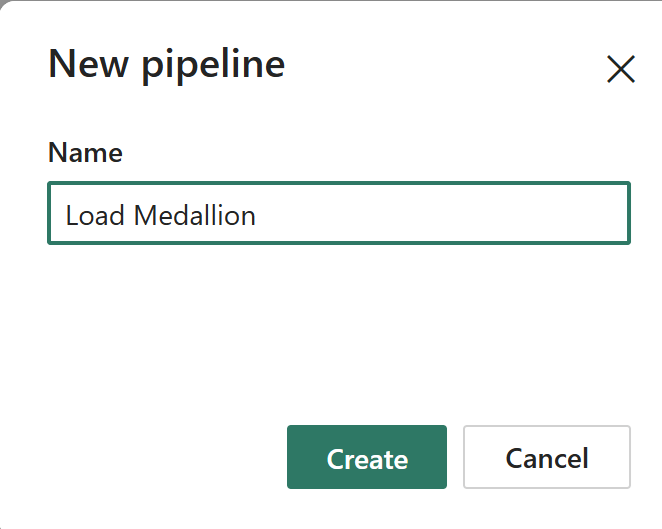

5. Select the **Activities** tile and select **Script** from the menu. 

    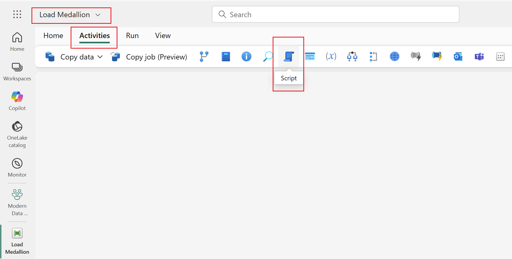


6. With the newly created **Script1** activity still selected, on the **General** page, enter **Load Bronze DW** for the **Name** of the activity. 

    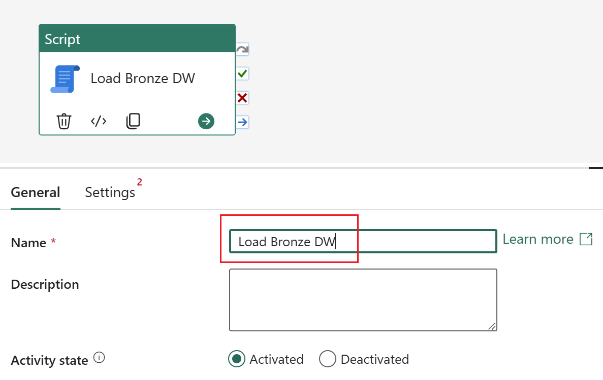

7. Navigate to the **Settings** page. From the **Connection** dropdown select the **WWI_Bronze** warehouse if available already. If you have selected bronze data warehouse, you are finished with this step.
Otherwise select **Browse all**, click on **OneLake catalog** and select **WWI_Bronze** warehouse.

    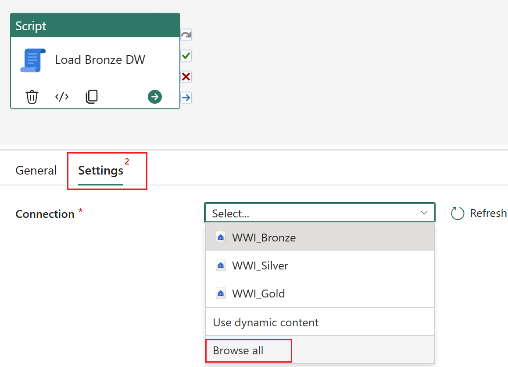

    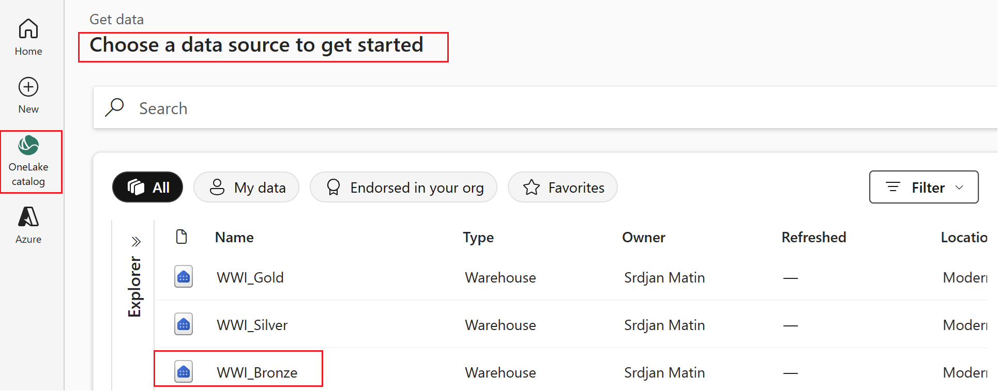

8. Within **Settings** page, 
    - Choose **NonQuery** option 
    - Select the **pencil icon** to the right of the script box to open the editor.

    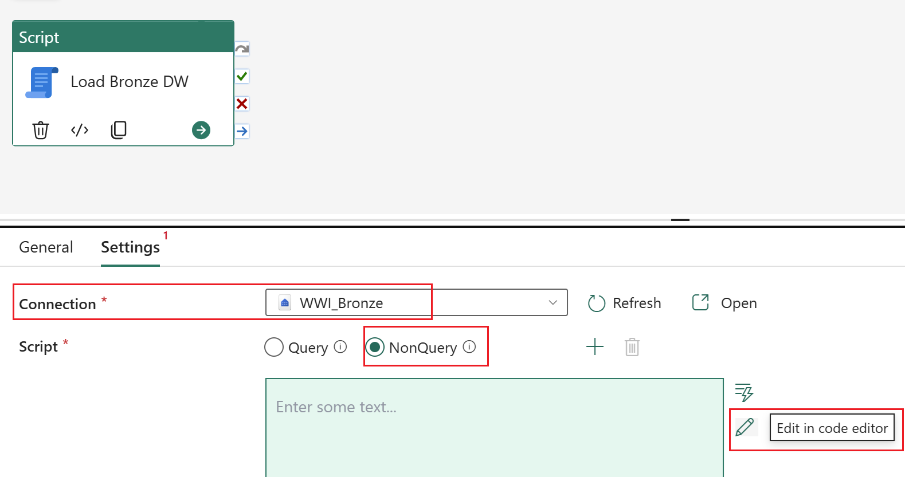 

    - Enter the following code, which was also used in *Lab 2 - Creating and loading Bronze layer* to copy data from storage account to WWI_Bronze. Notice that for sake of this lab, we would load all the data into the Bronze layer with every pipeline run.

    ``` sql
    EXEC dbo.sp_loadCustomers;
    EXEC dbo.sp_loadStockItems;
    EXEC dbo.sp_loadInvoices;
    EXEC dbo.sp_loadInvoiceLines;
    ```
    
    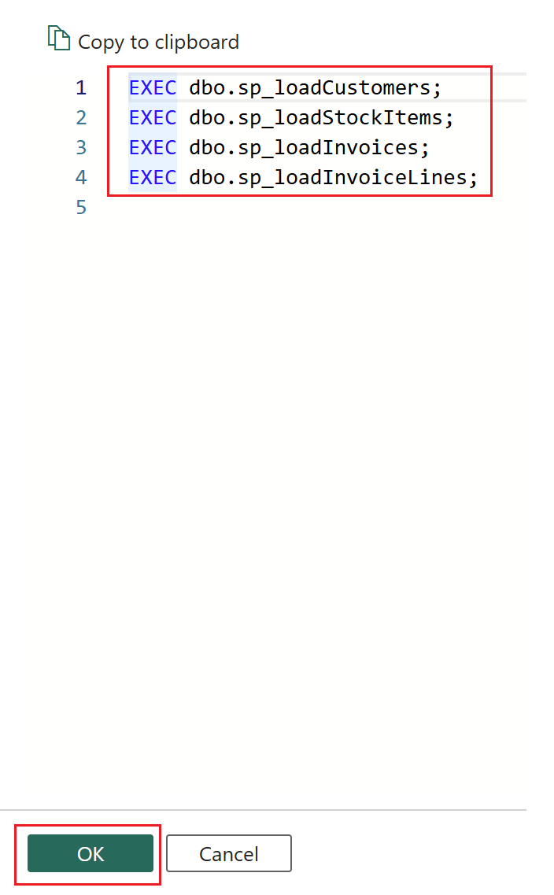

    - Select **OK**.

9. We would be repeating steps 5-8 for Silver layer load.
    - From the ribbon, navigate to the **Activities** tab. Select the **Script** activity to add it to the canvas. 
    - Name script activity as **Load Silver DW**
    - Choose (from the list or by browsing OneLake catalog) **WWI_Silver** as connection
    - Choose **NonQuery** option 
    - Select the **pencil icon** to the right of the script box to open the editor.
    - Enter the following code, which was also used in *Lab 3 - Creating and loading Silver layer* to copy data from storage account to WWI_Silver. Notice that for sake of this lab, we would load all the data into the Silver layer with every pipeline run.

    ``` sql
    EXEC dbo.sp_loadCustomers;
    EXEC dbo.sp_loadStockItems;
    EXEC dbo.sp_loadInvoices;
    EXEC dbo.sp_loadInvoiceLines;
    EXEC dbo.sp_loadFactSales; -- note that the input parameter has been intentionally omitted to ensure all data is loaded
    ```
    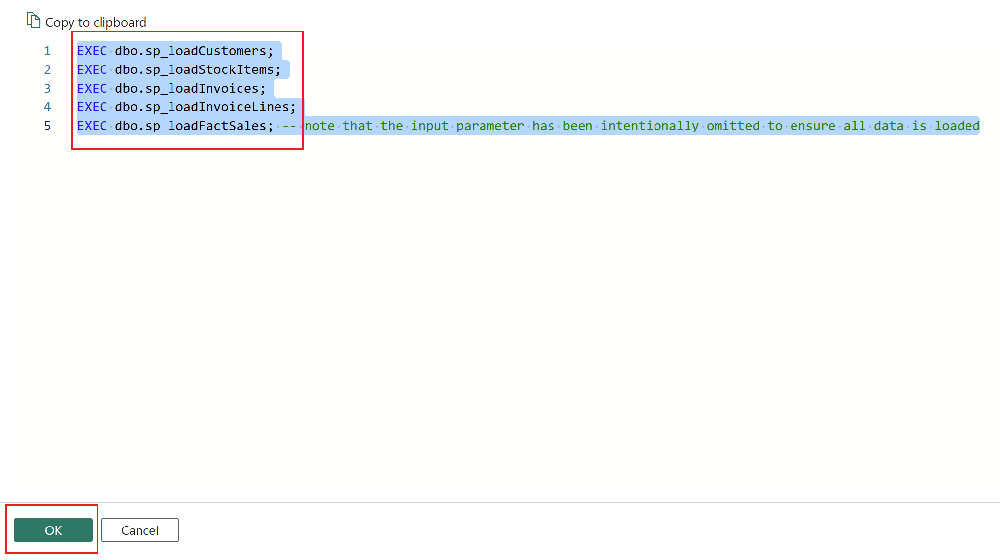
    - Select **OK**.

10. With these 2 script activities configured, it is time to connect them to ensure the proper processing order is followed; bronze tables should be loaded before the silver data model is loaded. Locate the **checkbox** on the right side of the **Load Bronze DW** script activity. Click and hold on the checkbox to select the **On success** (green checkbox) output. While continuing to hold the mouse button, drag and drop the arrow onto the **Load Silver DW** script activity. A green line should now connect the two activities.

    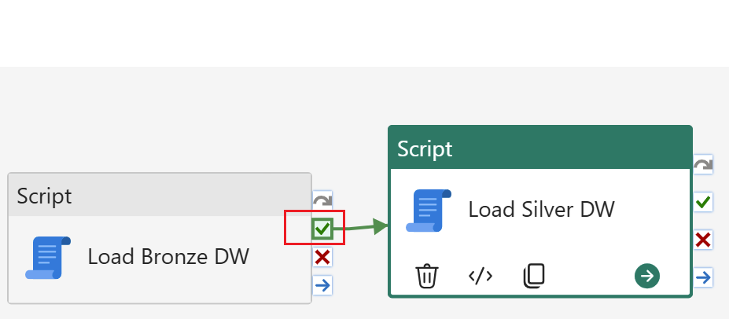

11. We would be repeating steps 5-8 for Gold layer load, where we would separate load of dimensional table from the load of the fact table. Notice that in this case logic used in stored procedures ensure only changed and new data is loaded.

    - Create one script activity named **Load Gold DW - Dim**
    - Choose (from the list or by browsing OneLake catalog) **WWI_Gold** as connection
    - Enter following code in that script activity
    ``` sql
    EXEC dbo.CreateUnknownMembers;
    EXEC dbo.UpdateDimBrand;
    EXEC dbo.UpdateDimCustomer;
    EXEC dbo.UpdateDimStockItem;
    ```
    - Select **OK**.
    - Connect **Load Silver DW** with **Load Gold DW - Dim** in same manner as described in step 10. We would be loading dimensional model only in case of success execution of the previous step.
    - At the end of this step your pipeline would look like on picture below

    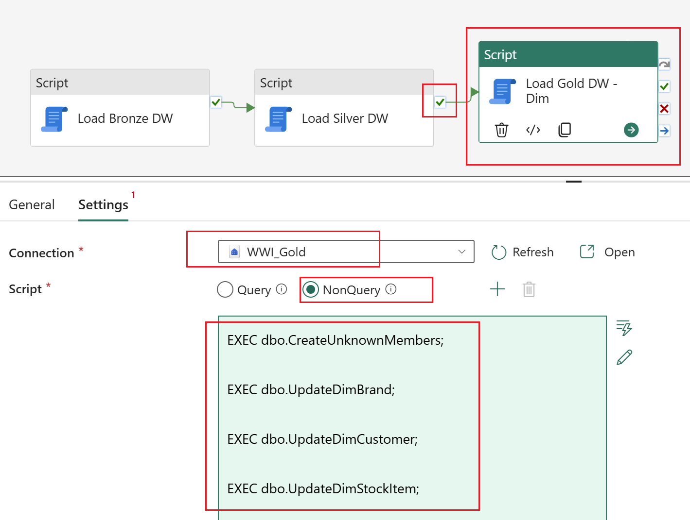

12. Repat step 11 for Fact table load.
    - Create one script activity named **Load Gold DW - Fact**
    - Choose **WWI_Gold** as connection
    - Enter following code in that script activity
    ``` sql
    EXEC dbo.UpdateFactSale;
    ```
    - Select **OK**.
    - Connect **Load Gold DW- Dim** with **Load Gold DW - Fact**. We would be loading fact table only in case of successful execution of the previous step. Notice that logic withing Fact table stored procedure ensures incremental load of this table.
    - At the end of this step your pipeline would look like similar to the image below.

    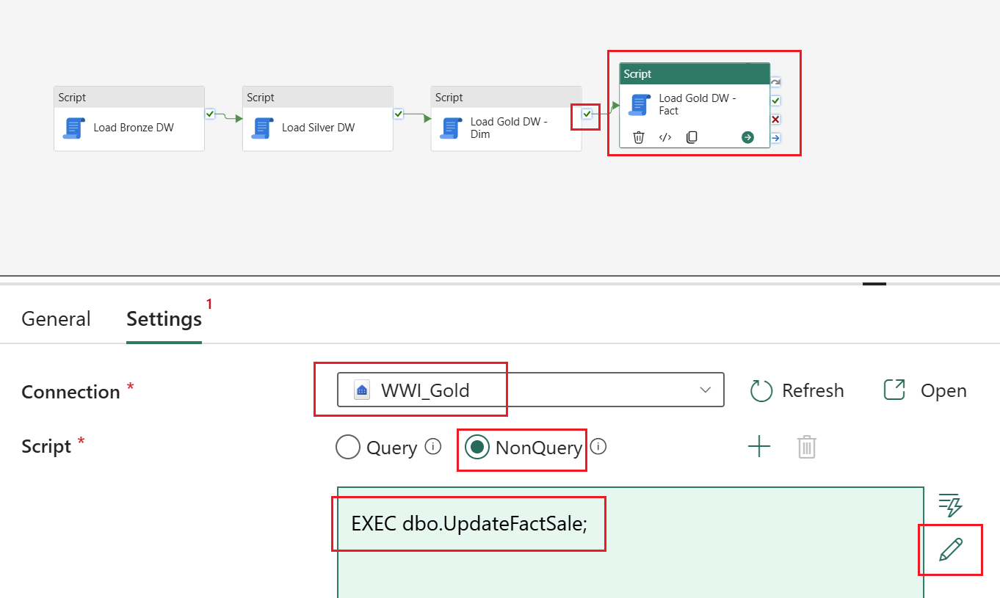

13. Select the **auto align** canvas button on the canvas settings to better align the activities. Verify the pipeline is configured correctly. The diagram should look similar to the image below.

    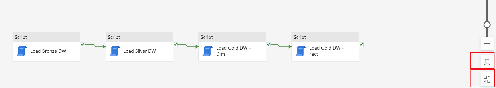

14. Navigate to the **Home** tab on the ribbon and select **Save**.

    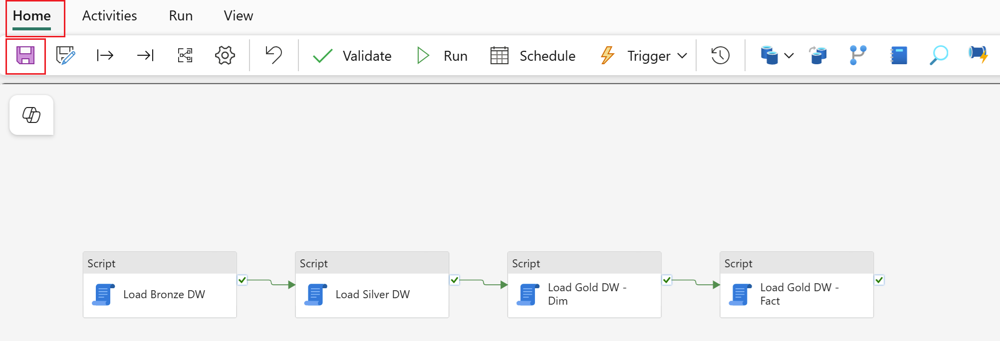

<h3 id = "5.2">5.2 - Running the pipeline</h3>

1. While still in the pipeline editor, navigate to the **Home** tab on the ribbon and select **Run**.

    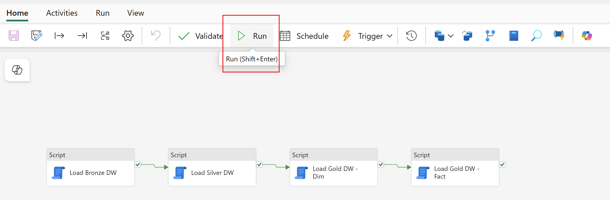

2. While still in the pipeline editor, monitor pipeline execution. At the end of the execution, your pipeline output shoud look simiar to the image below.

    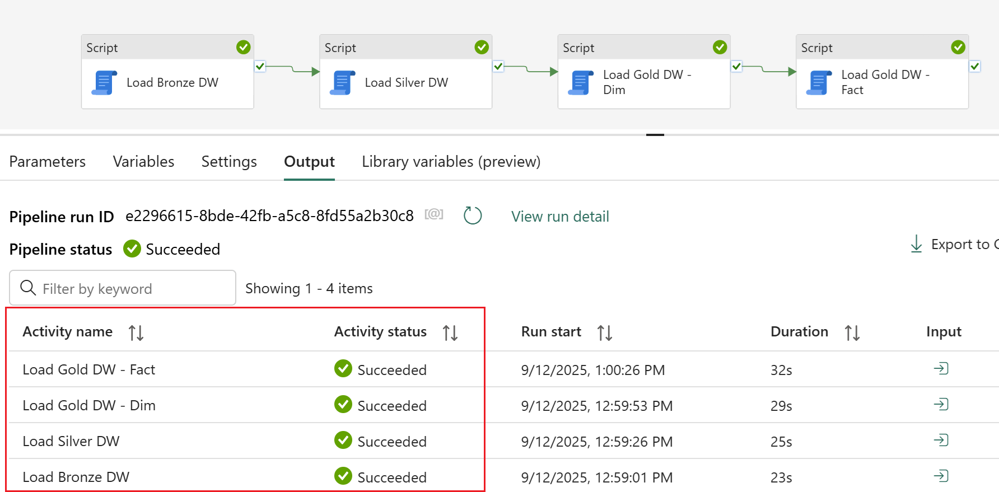

<h3 id = "5.3">5.3 - Scheduling the pipeline</h3>

*Note: This step is optional as step 5.2 loaded all the changes from Bronze->Silver to Gold layer.

1. While still in the pipeline editor, navigate to the **Home** tab on the ribbon and select **Schedule**.

    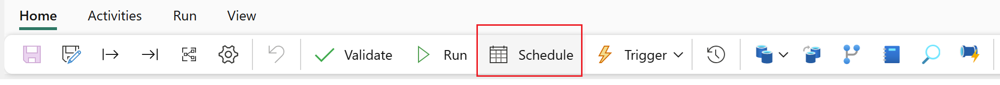

2. Configure the schedule with the following settings.

    *Note: If you are going through this content outside the Fabric Community Conference workshop, you will need to adjust your dates and times accordingly. Start date and time should be a time at or before now, and the end date and time should be some time at least 5 minutes in the future to allow for some additional sales data to be loaded.*

    - Change the **Scheduled run** radio button to **On**.
    - Repeat: **By the hour**
    - Every: **1** hour(s)
    - Start date and time: **Today's date at 9:00 AM** to align with the start of the workshop.
    - End date and time: **Today's date at 5:00 PM** to align with the conclusion of the workshop.
    - Time zone: **(UTC+01:00)...** to align with the time zone of the workshop.
    - Select **Apply**.
    - Select the **X** in the top right corner of the pane to close the schedule settings. 

    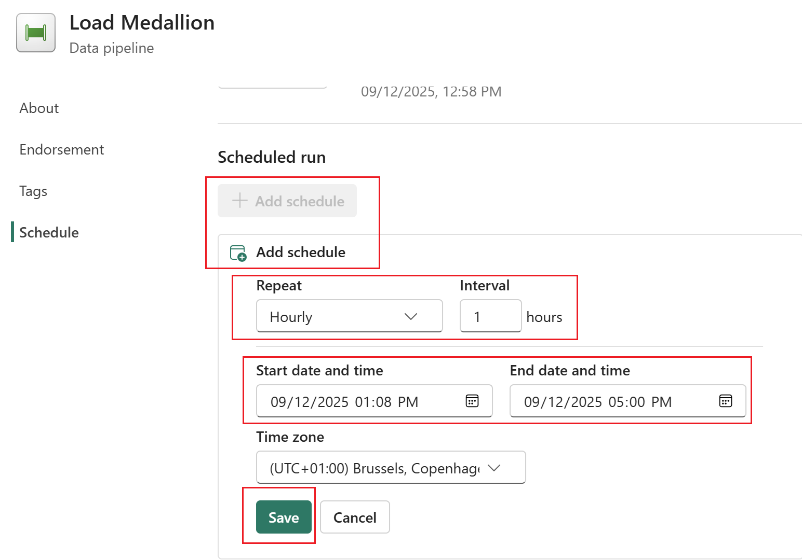

<h3 id = "5.4">5.4 - Validating dimensional model load</h3>

1. Return to the *Modern Data Warehousing on Microsoft Fabric* workspace created in *Lab 0 - Lab environment setup* by selecting the **workspace icon** from the left navigation bar. 

    *Note: The icons on the navigation bar can be pinned and unpinned. Therefore, the icons you see may differ from the screenshot.*


2. From the item list, select **GoldLayer** notebook and navigate to **Lab 4.4 - Incremental load validation** section. Run the cell. 
3. Once executed, the cell will display query results showing record counts for all tables in the Silver and Gold models.
After completing **Lab 5 – Orchestrating warehouse operations**, both the Silver and Gold layers will include data for additional years: 2014–2016.
At the end of this exercise, the difference in row counts between corresponding tables in these two layers will reflect the presence of an Unknown member entry.
This behavior will change for the DimStockItem table as part of **Lab 7 – BonusLabs**, specifically in section *7.4 – Change Existing Dimensional Model*.

    ``` sql
        SELECT 'gold'   AS MedallionLayer, 'DimBrand'        AS TableName, FORMAT(COUNT_BIG(*), 'N0') AS RecordCount FROM dbo.DimBrand                                               UNION ALL
        SELECT 'gold'   AS MedallionLayer, 'DimCustomer'     AS TableName, FORMAT(COUNT_BIG(*), 'N0') AS RecordCount FROM dbo.DimCustomer                                            UNION ALL
        SELECT 'gold'   AS MedallionLayer, 'DimStockItem'    AS TableName, FORMAT(COUNT_BIG(*), 'N0') AS RecordCount FROM dbo.DimStockItem                                           UNION ALL
        SELECT 'gold'   AS MedallionLayer, 'FactSale'        AS TableName, FORMAT(COUNT_BIG(*), 'N0') AS RecordCount FROM dbo.FactSale                                               UNION ALL
        SELECT 'gold'   AS MedallionLayer, 'FactSale - 2013' AS TableName, FORMAT(COUNT_BIG(*), 'N0') AS RecordCount FROM dbo.FactSale WHERE YEAR(InvoiceDate) = 2013                UNION ALL
        SELECT 'gold'   AS MedallionLayer, 'FactSale - 2014' AS TableName, FORMAT(COUNT_BIG(*), 'N0') AS RecordCount FROM dbo.FactSale WHERE YEAR(InvoiceDate) = 2014                UNION ALL
        SELECT 'gold'   AS MedallionLayer, 'FactSale - 2015' AS TableName, FORMAT(COUNT_BIG(*), 'N0') AS RecordCount FROM dbo.FactSale WHERE YEAR(InvoiceDate) = 2015                UNION ALL
        SELECT 'gold'   AS MedallionLayer, 'FactSale - 2016' AS TableName, FORMAT(COUNT_BIG(*), 'N0') AS RecordCount FROM dbo.FactSale WHERE YEAR(InvoiceDate) = 2016                UNION ALL

        SELECT 'silver' AS MedallionLayer, 'Customers  '     AS TableName, FORMAT(COUNT_BIG(*), 'N0') AS RecordCount FROM WWI_Silver.dbo.Customers                                  UNION ALL
        SELECT 'silver' AS MedallionLayer, 'DimStockItem'    AS TableName, FORMAT(COUNT_BIG(*), 'N0') AS RecordCount FROM WWI_Silver.dbo.StockItems                                 UNION ALL
        SELECT 'silver' AS MedallionLayer, 'FactSale'        AS TableName, FORMAT(COUNT_BIG(*), 'N0') AS RecordCount FROM WWI_Silver.dbo.FactSale                                   UNION ALL
        SELECT 'silver' AS MedallionLayer, 'FactSale - 2013' AS TableName, FORMAT(COUNT_BIG(*), 'N0') AS RecordCount FROM WWI_Silver.dbo.FactSale WHERE YEAR(InvoiceDate) = 2013    UNION ALL
        SELECT 'silver' AS MedallionLayer, 'FactSale - 2014' AS TableName, FORMAT(COUNT_BIG(*), 'N0') AS RecordCount FROM WWI_Silver.dbo.FactSale WHERE YEAR(InvoiceDate) = 2014    UNION ALL
        SELECT 'silver' AS MedallionLayer, 'FactSale - 2015' AS TableName, FORMAT(COUNT_BIG(*), 'N0') AS RecordCount FROM WWI_Silver.dbo.FactSale WHERE YEAR(InvoiceDate) = 2015    UNION ALL
        SELECT 'silver' AS MedallionLayer, 'FactSale - 2016' AS TableName, FORMAT(COUNT_BIG(*), 'N0') AS RecordCount FROM WWI_Silver.dbo.FactSale WHERE YEAR(InvoiceDate) = 2016
        ORDER BY
            MedallionLayer,
            TableName
    ```

    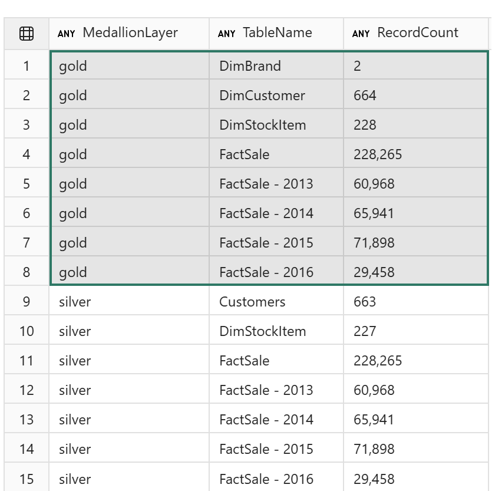

**Note**. If you rerun the pipeline from the previous step, you'll notice that the fact table in the Silver layer is reloaded with data for the years 2013–2016. However, due to the incremental load logic, this data is not duplicated in the Gold layer fact table.

## Next steps
In this lab you built a pipeline to orchestrate the repeated incremental loading of the data warehouse. You used a pipeline to ensure the operations happened in the proper order:

- Bronze is truncated and reloaded
- Silver is truncated and reloaded
- Unknown members are added to the dimension tables
- Dimension tables are incrementally loaded
- Fact table is incrementally loaded

While there are many complexities that will come into play in the real world, like late arriving data, varying load schedules, incrementally loading the bronze or silver layer data, etc. the work done in the modules to this point will serve as a general guide for loading a data warehouse.

- Continue to [Lab 6 Data warehouse management](<06 - Data warehouse management.md>)
- Return to the [workshop homepage](<../README.md>)

## Additional Resources
- [Ingest data into your Warehouse using data pipeline](https://learn.microsoft.com/en-us/fabric/data-warehouse/ingest-data-pipelines)
- [Data pipeline runs](https://learn.microsoft.com/en-us/fabric/data-factory/pipeline-runs)
- [How to monitor data pipeline runs in Microsoft Fabric](https://learn.microsoft.com/en-us/fabric/data-factory/monitor-pipeline-runs)
- [How to use Script activity](https://learn.microsoft.com/en-us/fabric/data-factory/script-activity)
