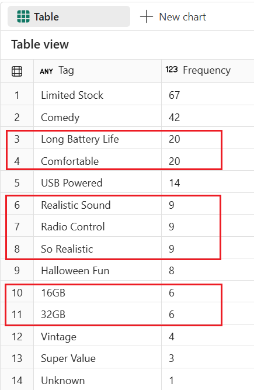

# End-to-End Data Engineering:<br>Modern Data Warehousing on Microsoft Fabric

## Lab 7 - Bonus labs

Before you begin:

- Make sure you have read the overview on the [workshop homepage](../README.md).
- If you have not completed [Lab 6 - Orchestrating warehouse operations](<06 - Data warehouse management.md>), go complete all the steps then return here to continue.

This lab will cover:

- <a href="#7.1">Time travel</a>
- <a href="#7.2">Clone a table</a>
- <a href="#7.3">Custom data masking</a>
- <a href="#7.4">Change existing dimensional model</a>

<hr>

Before you start: Download the [BonusLabs.ipynb](<../assets/code/BonusLabs.ipynb>) notebook and save it your computer (found in the assets/code folder of the GitHub repo). This notebook will be used throughout the lab so you do not need to copy/paste code frequently from the GitHub repo to the Fabric UX. Make sure you,
 - Import BonusLabs notebook into your Workspace.
 - Add WWI_Gold via Object explorer.

<h3 id = "7.1">7.1 - Time travel</h3>

1. Navigate to **Lab 7 - Bonus labs**, locate the **7.1 - Time travel** section.
2. Check the number of records in *dbo.FactSale* for January 1, 2013 by running the cell for **Step 7.1.3** in *BonusLabs* notebook. Upon completion, a set of query results will be displayed.

   ```sql
   SELECT 'dbo.FactSale'   AS TableName, COUNT(*) AS RecordCount FROM dbo.FactSale   WHERE InvoiceDate = '2013-01-01'
   ORDER BY TableName DESC
   ```
3. Delete the 89 records from fact.Sales table for January 1, 2013 and verify they were removed by running the cell for **Step 7.1.4**. Upon completion, a set of query results will be displayed.

   ```sql
    DELETE FROM dbo.FactSale WHERE InvoiceDate = '2013-01-01'
    SELECT COUNT(*) AS RecordCount FROM dbo.FactSale WHERE InvoiceDate = '2013-01-01'
   ```

   
4. We can validate that the data looked a certain way in the past using time travel. Use a dynamic SQL statement to do a count on the table as it looked 30 minutes ago by running the cell for **Step 7.1.5**. Upon completion, a set of query results will be displayed.

   ```sql
   DECLARE @BeforeTheAccident VARCHAR(23) = (SELECT CONVERT(VARCHAR(23), DATEADD(MINUTE, -30, GETDATE()), 126))
   EXEC ('SELECT COUNT(*) FROM dbo.FactSale WHERE InvoiceDate = ''2013-01-01'' OPTION (FOR TIMESTAMP AS OF ''' + @BeforeTheAccident + ''')');
   ```

   Using this query, we can verify there are in fact 89 records that are missing.

   

Now that we know the data exists, let's look at how table clones can help us recover.

<h3 id = "7.2">7.2 - Clone a table</h3>

Before beginning, open *BonusLabs* notebook, navigate to **Lab 7 - BonusLabs**, and locate the **7.2 - Clone a table** section.

1. Use a dynamic SQL statement to create a clone of the dbo.FactSale table as of about 30 minutes ago when the data from January 1, 2013 was still present in the table by running the cell for **Step 7.2.1**. Upon completion, the cell will have a messages output but no query results.

   ```sql
   DROP TABLE IF EXISTS dbo.FactSale_Recovery

   DECLARE @BeforeTheAccident VARCHAR(23) = (SELECT CONVERT(VARCHAR(23), DATEADD(MINUTE, -30, GETDATE()), 126))

   EXEC ('CREATE TABLE dbo.FactSale_Recovery AS CLONE OF dbo.FactSale AT ''' + @BeforeTheAccident + '''')
   ```

   
2. Count the number of records in the cloned table and compare it to the record count in the silver and gold model tables by running the cell for **Step 7.2.2** in *The Workshop* notebook.

   ```sql
   SELECT 'dbo.FactSale'          AS TableName, COUNT(*) AS RecordCount FROM dbo.FactSale          WHERE InvoiceDate = '2013-01-01' UNION ALL
   SELECT 'dbo.FactSale_Recovery' AS TableName, COUNT(*) AS RecordCount FROM dbo.FactSale_Recovery WHERE InvoiceDate = '2013-01-01'
   ORDER BY TableName DESC
   ```

   Notice there are no records in dbo.FactSale but there are 89 records in dbo.FactSale_Recovery.
3. Next, add the records back to the dbo.FactSale table by running the cell for **Step 7.2.3**. Verify the operation had the intended effect by comparing records counts one final time by examining the results.

   ```sql
   INSERT INTO dbo.FactSale
   SELECT * FROM dbo.FactSale_Recovery WHERE InvoiceDate = '2013-01-01'

   SELECT 'dbo.FactSale'          AS TableName, COUNT(*) AS RecordCount FROM dbo.FactSale          WHERE InvoiceDate = '2013-01-01' UNION ALL
   SELECT 'dbo.FactSale_Recovery' AS TableName, COUNT(*) AS RecordCount FROM dbo.FactSale_Recovery WHERE InvoiceDate = '2013-01-01'
   ORDER BY TableName DESC
   ```

<h3 id = "7.3">7.3 - Custom data masking</h3>

Before beginning, open *BonusLabs* notebook, navigate to **Lab 7 - BonusLabs**, and locate the **7.3 - Custom data masking** section.

1. Create custom logic for web site URL masking by running the cell for **Step 7.3.1**. 

   ```sql
   CREATE OR ALTER FUNCTION dbo.MaskWebsiteURL (@url VARCHAR(256))
   RETURNS VARCHAR(256)
   AS
   BEGIN
       DECLARE @result VARCHAR(256);

       -- Check if the URL is valid using a simple pattern matching for 'http://' or 'https://'
       IF PATINDEX('http://%', @url) = 1 OR PATINDEX('https://%', @url) = 1
       BEGIN
           -- Apply masking after 'http://' or 'https://'
           -- Find the first '/' after the domain part (to keep the domain visible)
           DECLARE @firstSlashPos INT;
           SET @firstSlashPos = CHARINDEX('/', @url, CHARINDEX('://', @url) + 3);

           -- If a slash is found, mask from there, otherwise just return the original URL
           IF @firstSlashPos > 0
           BEGIN
               SET @result = STUFF(@url, @firstSlashPos + 1, LEN(@url), REPLICATE('*', LEN(@url) - @firstSlashPos));
           END
           ELSE
           BEGIN
               -- Masking does not apply here, without a path
               SET @result = @url;
           END
       END
       ELSE
       BEGIN
           SET @result = 'invalid url';
       END

       RETURN @result;
   END;
   GO
   ```
2. Create custom logic for phone number masking (US dial plan format) by running the cell for **Step 7.3.2**. 

   ```sql
   CREATE OR ALTER FUNCTION dbo.MaskPhoneNumber (@phoneNumber VARCHAR(20))
   RETURNS VARCHAR(20)
   AS
   BEGIN
       DECLARE @result VARCHAR(20);

       -- Check if the phone number matches the expected format (e.g., (210) 555-0100)
       IF PATINDEX('(%[0-9][0-9][0-9]%) [0-9][0-9][0-9]-[0-9][0-9][0-9][0-9]', @phoneNumber) = 1
       BEGIN
           -- Mask the phone number, only revealing the area code and the last four digits
           SET @result = STUFF(@phoneNumber, 7, 3, '***');
       END
       ELSE
       BEGIN
           SET @result = 'invalid phone';
       END

       RETURN @result;
   END;
   GO
   ```
3. Verify that functions are created by looking into system objects, or Fabric UX Object explorer. Both of these functions would be used to apply custom masking logic on existing Customer dimension. 
Note: For scalar user-defined functions to be used in distributed queries, they must be inlineable. You can verify a function’s inlineability by inspecting system metadata, such as the is_inlineable column in sys.sql_modules. Run cell for **Step 7.3.3**.

   ```sql
    SELECT
        OBJECT_SCHEMA_NAME(sm.object_id) AS objectschemaname,
        OBJECT_NAME(sm.object_id) AS objectname,
        sm.definition,
        sm.is_inlineable
    FROM sys.sql_modules sm
    WHERE OBJECTPROPERTY(sm.object_id, 'IsScalarFunction')=1
   ```
    

4. Mask information considered sensitive (in our case, WebURL and PhoneNumber) by simply changing view over DimCustomer table. Run cell for **Step 7.3.4**.

   ```sql
   CREATE OR ALTER   VIEW dbo.vw_DimCustomer AS
   SELECT
               [CustomerSK],
               [CustomerSourceKey],
               [ContactFirstName],
               [ContactLastName],
               dbo.MaskPhoneNumber([PhoneNumber]) as PhoneNumber,
               dbo.MaskWebsiteURL([WebsiteURL]) AS WebsiteURL,
               [DeliveryAddressLine],
               [DeliveryPostalCode],
               [TimeInserted],
               [TimeLastChanged]
   FROM dbo.DimCustomer
   WHERE IsDeleted = 0;
   ```
5. Validate that view return masked values in WebURL and PhoneNumber column. Run cell for **Step 7.3.5**.

   ```sql
   SELECT TOP 10 *
   from dbo.vw_DimCustomer 
   ```

   

<h3 id = "7.4">7.4 - Change existing dimensional model</h3>
⚠️ Prerequisite: This lab requires prior completion of Lab 4 – Create and Load Gold Layer.
<a> 
</a>

Overview: 
In this lab, you will explore a scenario for further normalizing your dimensional model by adding a sub-dimension to the DimStockItem table.

⚠️ Important Note: After completing the changes in this lab, some scripts in the GoldLayer notebook may not work correctly if executed partially. To restore the WWI_Gold warehouse to its original state, you must run the entire GoldLayer notebook.

Learning Objectives

1. Apply model changes using the ALTER TABLE statement
2. Normalize the [Tags] field between Silver and Gold layers using the OPEN_JSON function
3. Implement code changes using CREATE OR ALTER
4. Apply data updates using the MERGE statement
5. Remove obsolete columns using the ALTER TABLE statement

Before beginning, open *BonusLabs* notebook, navigate to **Lab 7 - BonusLabs**, and locate the **7.4 - Change existing dimensional model** section.

1. Start with simple data exploration, and determine current distribution of rows per [Tags] column. Notice that single row contains multiple item tags. Run cell for **Step 7.4.1**.

   ```sql
   SELECT  Tags, COUNT(*) AS Frequency
   FROM dbo.DimStockItem
   GROUP BY Tags
   ORDER BY Frequency DESC
   ```

   
2. Run cell for **Step 7.4.2** to determine actual distribution per individual Tag items by applying OPENJON function on existing values.

   ```sql
       SELECT value AS Tag, COUNT(*) AS Frequency
       FROM dbo.DimStockItem
       CROSS APPLY OPENJSON(Tags)
       GROUP BY value
       ORDER BY Frequency DESC
   ```

   
3. Run cell for **Step 7.4.3** to create new sub-dimension table and alter existing DimStockItem by adding new key column.

   ```sql
       DROP TABLE IF EXISTS dbo.DimStockItemTag;
       GO

       -- Create DimStockItemTag table
       CREATE TABLE [dbo].[DimStockItemTag]
           (
               [StockItemTagSK]                  [int]           NOT NULL,
               [StockItemTagName]                [varchar](250)  NOT NULL,
               [TimeInserted]                    [datetime2](6)  NOT NULL,
               [TimeLastChanged]                 [datetime2](6)  NOT NULL,
               [IsDeleted]                       [bit]           NOT NULL
           );
       GO
       -- Add Tag ID in DimStockItem table. Notice it NULLable
       IF NOT EXISTS (
           SELECT 1 
           FROM INFORMATION_SCHEMA.COLUMNS 
           WHERE TABLE_SCHEMA = 'dbo' 
           AND TABLE_NAME = 'DimStockItem' 
           AND COLUMN_NAME = 'StockItemTagSK'
       )
       BEGIN
           ALTER TABLE DimStockItem ADD StockItemTagSK INT;
       END
       GO
   ```
4. Confirm that changes have been applied by running cell for **Step 7.4.4**. You should expect new StockItemTagSK column and new table DimStockItemTag added.

   ```sql
       SELECT TOP 10 *
       FROM [dbo].DimStockItem
       GO
       SELECT TOP 10 *
       FROM [dbo].DimStockItemTag
       GO
   ```
5. Run cell for **Step 7.4.5** to add unknown members and adjust keys.

   ```sql
       IF NOT EXISTS (SELECT * FROM dbo.DimStockItemTag WHERE StockItemTagSK = -1)
       INSERT INTO [dbo].[DimStockItemTag]
               ([StockItemTagSK]
               ,[StockItemTagName]
               ,[TimeInserted]
               ,[TimeLastChanged]
               ,[IsDeleted]) 
       SELECT -1, 'Unknown', GETUTCDATE(), GETUTCDATE(), 0
       GO

       UPDATE dbo.DimStockItem
       SET StockItemTagSK=-1, TimeLastChanged=GETUTCDATE()
       WHERE StockItemTagSK IS NULL
       GO

   ```
6. Run cell for **Step 7.4.6** to validate that table DimStockItemTag contains only Unknown member.
7. Run cell for **Step 7.4.7** to load DimStockItemTag table. Note: This lab includes an ad-hoc data load step. In a production scenario, this step would typically be integrated into your existing orchestration process.

   ```sql
       DECLARE @MaxID INT = (SELECT ISNULL(MAX(StockItemTagSK), 0) FROM dbo.DimStockItemTag);
       DECLARE @CurrentUTC DATETIME2= GETUTCDATE();

       WITH DistinctTags AS (
               SELECT DISTINCT value AS StockItemTagName
               FROM WWI_Silver.dbo.StockItems
               CROSS APPLY OPENJSON(Tags)
               WHERE Tags IS NOT NULL
       ),
       src AS (
           SELECT
               @MaxID + ROW_NUMBER() OVER (ORDER BY (SELECT NULL)) AS StockItemTagSK,
               StockItemTagName
           FROM DistinctTags
       )
       MERGE dbo.DimStockItemTag T
       USING src AS S
           -- match on normalized business key
           ON T.StockItemTagName = S.StockItemTagName
       WHEN MATCHED AND (
           -- update only if something actually changed (e.g., casing/spacing)
           ISNULL(T.StockItemTagName, '') <> ISNULL(S.StockItemTagName, '')
       ) THEN
           UPDATE SET
               T.StockItemTagName = S.StockItemTagName,
               T.TimeLastChanged=@CurrentUTC
       WHEN NOT MATCHED BY TARGET THEN
           INSERT (StockItemTagSK, StockItemTagName, TimeInserted, TimeLastChanged, IsDeleted)
           VALUES (S.StockItemTagSK, S.StockItemTagName, @CurrentUTC, @CurrentUTC, 0);
       GO
   ```
8. Run cell for **Step 7.4.8** to confirm that table DimStockItemTag is loaded.

   ```sql
       SELECT TOP 10 *
       FROM dbo.DimStockItemTag
       GO
   ```

   
9. Run the cell for **Step 7.4.9** to check the current cardinality of the DimStockItem table.
The expected result is 228 records.
10. Run **Step 7.4.10** to reload data into the updated DimStockItem table using the MERGE statement. This step applies a soft-delete approach, allowing you to compare the dataset before and after the changes. Notice that actual step affects more than 228 rows.

    ```sql
        DECLARE @MaxID int = (SELECT ISNULL(MAX(StockItemSK), 0) FROM dbo.DimStockItem);
        DECLARE @CurrentUTC DATETIME2= GETUTCDATE();

        ;WITH src AS
        (
            SELECT DISTINCT
                StockItemSK = @MaxID + ROW_NUMBER() OVER (ORDER BY (SELECT NULL)),
                StockItemSourceKey = si.StockItemID,
                si.StockItemName,
                ISNULL(db.BrandSK, -1) AS BrandSK,
                si.PackageTypeName,
                si.TaxRate,
                si.UnitPrice,
                ISNULL(dtag.StockItemTagSK,-1) as StockItemTagSK
            FROM WWI_Silver.dbo.StockItems AS si
                LEFT JOIN dbo.DimBrand AS db
                    ON db.BrandName = si.Brand
                OUTER APPLY OPENJSON(si.Tags) AS otag
                LEFT JOIN dbo.DimStockItemTag AS dtag 
                    ON dtag.StockItemTagName=otag.value
        )
        MERGE dbo.DimStockItem T
        USING (
            -- Align datatypes to target to ensure null-safe comparisons are accurate
            SELECT
                S.StockItemSK,
                S.StockItemSourceKey,
                S.StockItemName,
                CAST(S.BrandSK AS varchar(50)) AS BrandSK,  -- target is varchar(50)
                S.PackageTypeName,
                S.TaxRate,
                S.UnitPrice,
                S.StockItemTagSK as StockItemTagSK
            FROM src AS S
        ) AS S
        ON T.StockItemSourceKey = S.StockItemSourceKey AND T.StockItemTagSK= S.StockItemTagSK

        WHEN MATCHED 
        AND (
            ISNULL(T.StockItemName,    '') <> ISNULL(S.StockItemName,    '')
            OR ISNULL(T.BrandSK,          '') <> ISNULL(S.BrandSK,          '')
            OR ISNULL(T.PackageTypeName,  '') <> ISNULL(S.PackageTypeName,  '')
            OR ISNULL(T.TaxRate,         0.0) <> ISNULL(S.TaxRate,         0.0)
            OR ISNULL(T.UnitPrice,       0.0) <> ISNULL(S.UnitPrice,       0.0)
            OR ISNULL(T.StockItemTagSK, -1)   <> ISNULL(S.StockItemTagSK, -1)
        ) THEN
            UPDATE SET
                T.StockItemName     = S.StockItemName,
                T.BrandSK           = S.BrandSK,
                T.PackageTypeName   = S.PackageTypeName,
                T.TaxRate           = S.TaxRate,
                T.UnitPrice         = S.UnitPrice,
                T.StockItemTagSK    = ISNULL(S.StockItemTagSK, -1),
                T.TimeLastChanged   = @CurrentUTC

        WHEN NOT MATCHED BY TARGET THEN
            INSERT (
                StockItemSK,
                StockItemSourceKey,
                StockItemName,
                BrandSK,
                PackageTypeName,
                TaxRate,
                UnitPrice,
                StockItemTagSK,
                TimeInserted,
                TimeLastChanged,
                IsDeleted
            )
            VALUES (
                S.StockItemSK,
                S.StockItemSourceKey,
                S.StockItemName,
                S.BrandSK,
                S.PackageTypeName,
                S.TaxRate,
                S.UnitPrice,
                S.StockItemTagSK,
                @CurrentUTC,
                @CurrentUTC,
                0
            )
        -- Delete old rows with NULL tag key
        WHEN NOT MATCHED BY SOURCE 
            AND T.StockItemTagSK=-1 
            AND IsDeleted=0 
            AND StockItemSK!=-1 -- keep uknown member
            THEN 
            UPDATE SET IsDeleted=1;
        GO
    ```

    
11. Run cell for **Step 7.4.11** to explore changes being made.

    ```sql
        -- Check IsDeleted distribution
        SELECT IsDeleted, COUNT(*) as Frequency
        FROM dbo.DimStockItem
        GROUP BY IsDeleted
        ORDER BY 1
        GO
        -- Check those with multiple entries per BK (contain multiple tags)
        SELECT StockItemSourceKey, COUNT(*) as Frequency
        FROM dbo.DimStockItem
        GROUP BY StockItemSourceKey
        HAVING COUNT(*)>1
        ORDER BY 1, 2 DESC
        GO
        -- Check StockItemTagSK distribution
        SELECT IsDeleted, StockItemTagSK, COUNT(*) as Frequency
        FROM dbo.DimStockItem
        GROUP BY IsDeleted, StockItemTagSK
        ORDER BY 1, 2 DESC
        GO
        -- Explore data
        SELECT TOP 10 *
        FROM dbo.DimStockItem
        WHERE StockItemSourceKey=10
        GO
    ```
12. After confirming that all desired changes are made, lets remove redudant Tag column. Notice that process is irreversable. Run cell for **Step 7.4.12**. Confirm that [Tags] column is removed from [DimStockItem] table.

    ```sql
        IF EXISTS (
            SELECT 1 
            FROM INFORMATION_SCHEMA.COLUMNS 
            WHERE TABLE_SCHEMA = 'dbo' 
            AND TABLE_NAME = 'DimStockItem' 
            AND COLUMN_NAME = 'Tags'
        )
        BEGIN
            ALTER TABLE DimStockItem DROP COLUMN Tags;
        END
        GO
    ```
## Next steps

In this lab, you used **time travel** to examine how tables appeared at a specific point in the past. This allowed you to identify that certain data had been accidentally deleted. To recover the missing records, you created a **clone of the affected table** as of the time when the data still existed. Using this clone, you **restored the deleted records back** into the original table.
You also applied **scalar user-defined functions to mask sensitive data**. Depending on the use case, these changes can be propagated into the semantic model or used to permanently anonymize the data. 
Finally, you performed **live changes on the existing dimensional model** in the Gold layer. This included normalizing an existing dimension by adding a sub-dimension, and updating data while preserving historical records using a soft-delete strategy. These operations were carried out using the **ALTER statement, JSON functions, and the MERGE statement**.

You did it! You completed all the labs for this workshop!

This may be where our workshop ends today, but it is not the end of the analytics journey. Beyond the data warehouse is a world full of visualizations with Power BI, data science with Spark, and AI use cases waiting to bring more value to your business. We would encourage you to check out the rest of what Microsoft Fabric has to offer!

- Return to the [workshop homepage](../README.md)

## Additional Resources

- [Clone table in Microsoft Fabric Data Warehouse](https://learn.microsoft.com/en-us/fabric/data-warehouse/clone-table)
- [Clone tables in the Fabric portal](https://learn.microsoft.com/en-us/fabric/data-warehouse/tutorial-clone-table-portal)
- [Restore in-place of a warehouse in Microsoft Fabric](https://learn.microsoft.com/en-us/fabric/data-warehouse/restore-in-place)
- [Restore in-place in the Fabric portal](https://learn.microsoft.com/en-us/fabric/data-warehouse/restore-in-place-portal)
- [Query using time travel at the statement level](https://learn.microsoft.com/en-us/fabric/data-warehouse/how-to-query-using-time-travel)
- [Create user-defined functions](https://learn.microsoft.com/en-us/sql/t-sql/statements/create-function-sql-data-warehouse?view=fabric&preserve-view=true)
- [Dynamic data masking](https://learn.microsoft.com/en-us/fabric/data-warehouse/dynamic-data-masking)
- [Alter table in Microsoft Fabric Data Warehouse](https://learn.microsoft.com/en-us/sql/t-sql/statements/alter-table-transact-sql?view=fabric)